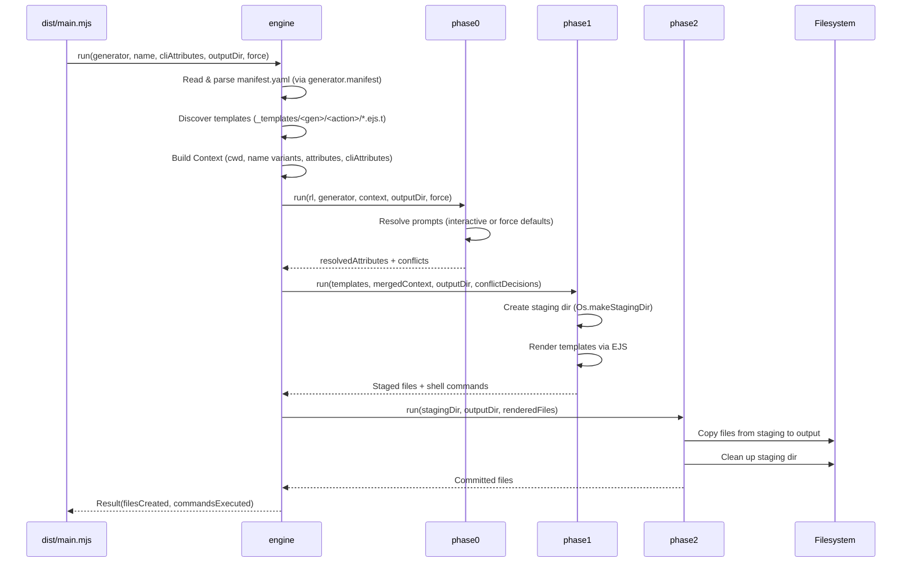
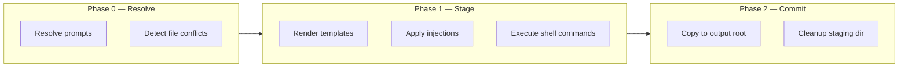
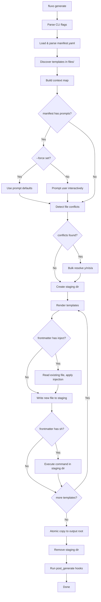
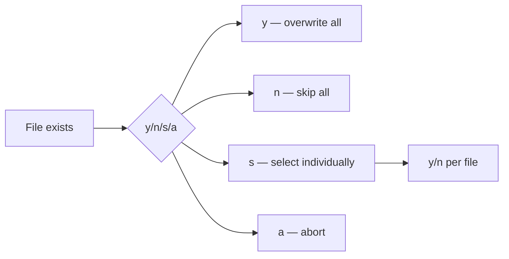
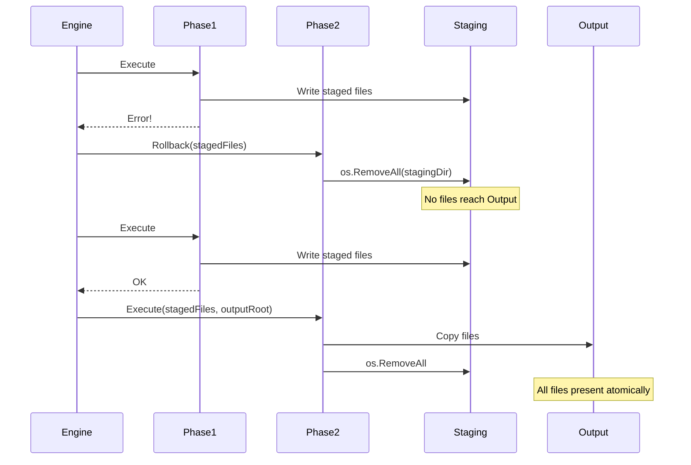

# Architecture

## Execution pipeline



## Package structure

```
src/
├── interfaces/cli/          CLI entry point (Cli.res, Main.res)
├── application/
│   ├── engine/              Pipeline orchestrator (Engine.res)
│   └── pipeline/            Phase0/1/2 (Phase0.res, Phase1.res, Phase2.res)
├── infrastructure/
│   ├── discovery/           FS traversal, template index (Discovery.res)
│   ├── rendering/           EJS template rendering (Renderer.res)
│   ├── prompts/             Interactive prompt resolution (PromptResolver.res)
│   └── bindings/            Node.js/third-party FFI (NodeJs.res, Bindings.res)
├── domain/
│   └── context/             Context building, name variants, merge (Context.res)
└── main/                    Main module wrapper
```

## Three-phase execution



| Phase | Action | Failure handling |
|-------|--------|-----------------|
| 0 | Prompt resolution, conflict detection | Return error immediately |
| 1 | Render to `os.TempDir()`, inject, execute shell | **Rollback**: `os.RemoveAll(stagingDir)` |
| 2 | Atomic copy to output root | No partial writes — commit is all-or-nothing |

## Component state flow



## Conflict resolution



## Rollback safety

Every error path in the pipeline cleans up after itself:


