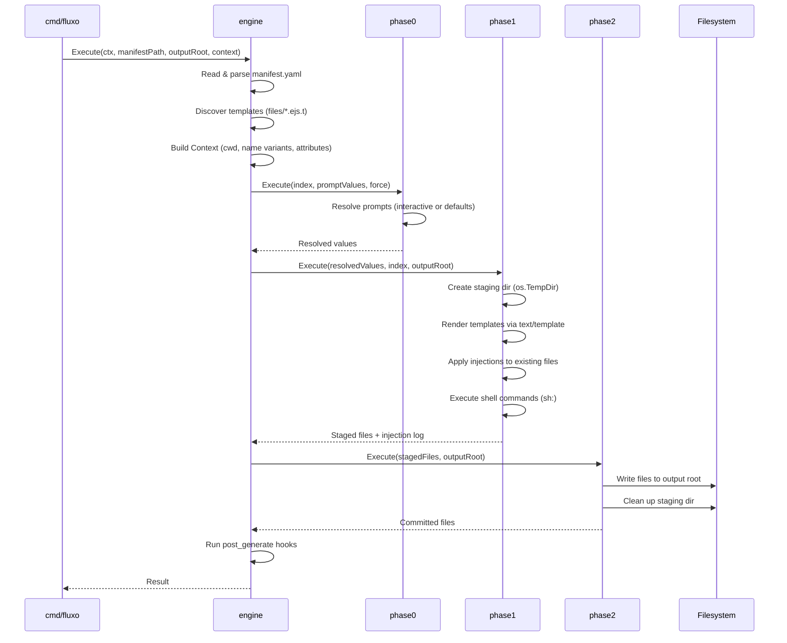
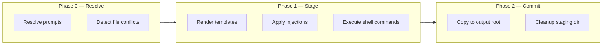
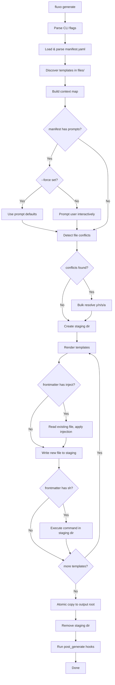
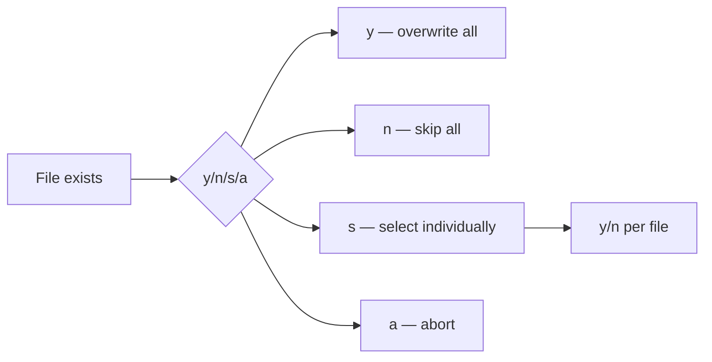
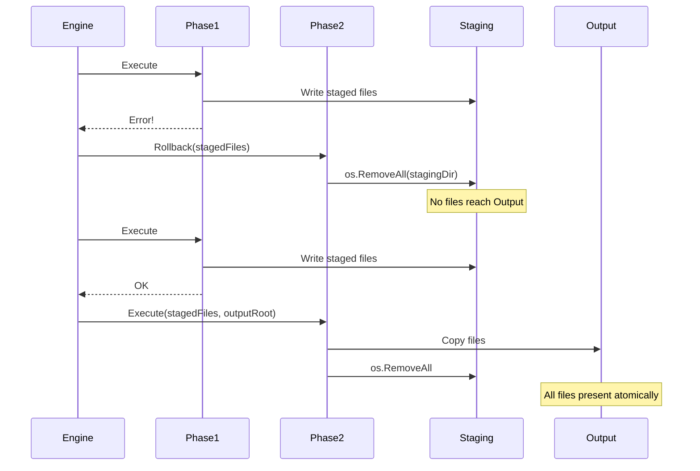

# Architecture

## Execution pipeline



## Package structure

```
cmd/
└── fluxo/
    └── main.go              CLI entry point

internal/
├── engine/
│   └── engine.go            Pipeline orchestrator, Context struct
├── manifest/
│   └── manifest.go          manifest.yaml parsing & validation
├── discovery/
│   └── discovery.go         FS traversal, template index
├── phases/
│   ├── phase0/
│   │   ├── phase0.go        Prompt routing & conflict detection
│   │   └── prompt_resolver.go  Interactive prompt resolution
│   ├── phase1/
│   │   ├── phase1.go        Staging, rendering, injection dispatch
│   │   └── shell.go         Shell command execution
│   └── phase2/
│       └── phase2.go        Atomic commit & rollback
├── templates/
│   ├── template.go          Template struct & Directives
│   ├── frontmatter.go       Frontmatter parsing, ApplyInjection
│   └── funcmaps.go          Go template FuncMaps
├── hooks/
│   └── hooks.go             Pre/post generate hook execution
└── conflicts/
    └── conflicts.go         Bulk conflict resolution
```

## Three-phase execution



| Phase | Action | Failure handling |
|-------|--------|-----------------|
| 0 | Prompt resolution, conflict detection | Return error immediately |
| 1 | Render to `os.TempDir()`, inject, execute shell | **Rollback**: `os.RemoveAll(stagingDir)` |
| 2 | Atomic copy to output root | No partial writes — commit is all-or-nothing |

## Component state flow



## Conflict resolution



## Rollback safety

Every error path in the pipeline cleans up after itself:


