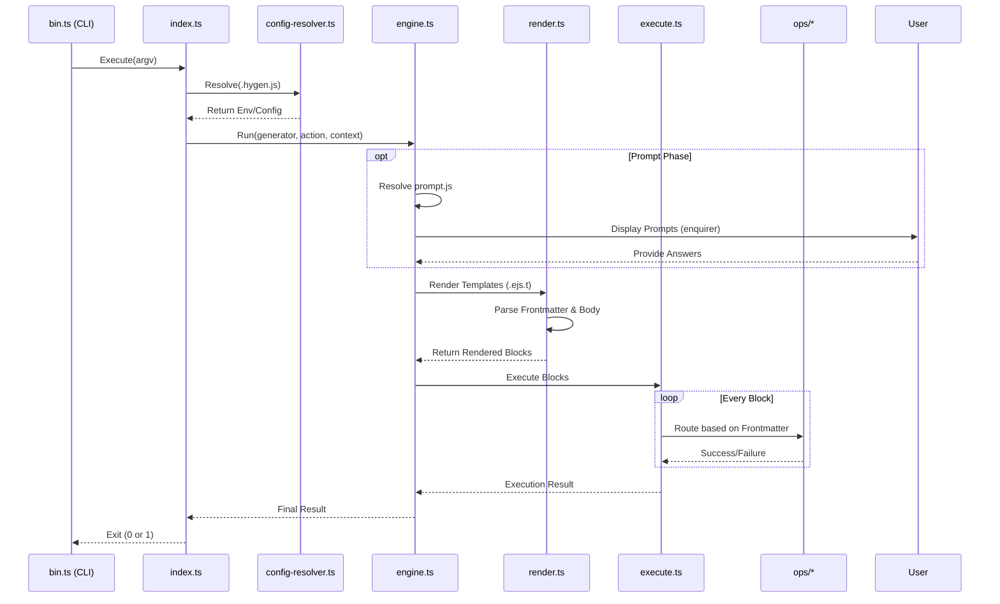
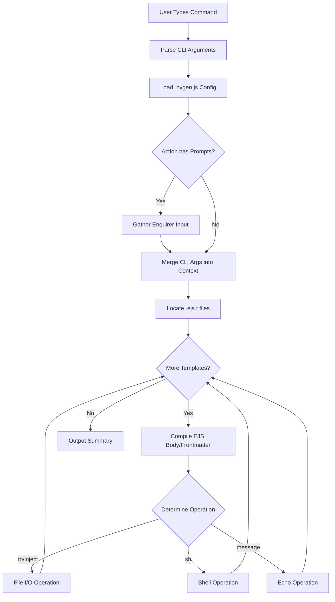

# Hygen Architecture & Specifications Baseline

This document captures the reverse-engineered specifications of the original Node.js/EJS-based Hygen template engine. It serves as the definitive functional spec for developing **Fluxo**, the Go-based port.

## Quick Path: Core Execution Flow

When a user runs `hygen <generator> <action>`, the execution strictly follows this deterministic control flow:

1. **CLI Entry (`bin.ts`)**: Captures `process.argv` and kicks off the runner.
2. **Runner (`index.ts`)**: Resolves configurations, initializes the environment, and invokes the engine.
3. **Engine (`engine.ts`)**: Discovers templates, parses prompt interactions, and passes contextual variables to the renderer.
4. **Renderer (`render.ts`)**: Compiles `.ejs.t` files (via EJS) mapping template frontmatter to file paths and EJS blocks to file bodies.
5. **Executor (`execute.ts`)**: Maps parsed blocks to explicit operational modules (`ops/*`).
6. **Operations (`ops/*`)**: Executes changes (e.g., adding a file, running a shell command).

## Details: Subsystem Specifications

### 1. Context & Variable Injection
Hygen injects a consistent set of context variables natively, accessible inside every EJS template.

| Context Variable | Description |
|------------------|-------------|
| `cwd`            | Current working directory where the CLI was invoked. |
| `actionfolder`   | The absolute path to the folder containing the active generator action. |
| `name` / `Name`  | Parsed directly from CLI input (pascal, camel, snake cased variants exist via helpers). |
| `names` / `Names`| Pluralized variants of the primary component name. |
| `attributes`     | A map of key-value attributes passed via CLI args (e.g., `--key value`). |
| `h` (helpers)    | Inflection helpers injected globally (e.g., `h.capitalize`, `h.changeCase`). |

### 2. File Format (`.ejs.t`)
Hygen templates are hybrid files utilizing **Frontmatter** for operation configuration and **Body** for file contents.

```text
---
to: path/to/target/file.txt
force: true
---
File content goes here, utilizing EJS tags like <%= name %>
```

### 3. Operation Types (`ops/*`)
Frontmatter properties define the operation mapped during execution. 

| Frontmatter Key | Associated Operation | Behavior |
|-----------------|----------------------|----------|
| `to:`           | `add` (or `inject`)  | Writes the template body to a file. Overwrites if `force: true`. If `inject: true` is set, modifies an existing file instead. |
| `sh:`           | `shell`              | Executes a child process command. |
| `message:`      | `echo`               | Outputs a message to `stdout` during the execution cycle. |
| `setup:`        | `setup`              | Executes preparatory scripts/prompts. |

### 4. Configuration & Prompts
- **Config Resolver (`config-resolver.ts`)**: Looks for `.hygen.js` in the project root to load custom context and helper overrides.
- **Prompts (`enquirer`)**: If a `prompt.js` or `index.js` exists in the generator action folder, Hygen resolves it utilizing the `enquirer` library to interactively prompt users before execution, merging prompt answers into the context map.

## Flow Diagrams

### Execution Sequence Diagram



### Component State Flow



## Checklist for Go Port Parity
- [ ] Context variable injection correctly maps JS objects to Go structs/maps.
- [ ] EJS rendering engine parity (via Go text/template or equivalent).
- [ ] Frontmatter parsing exactly splits operation attributes vs body content.
- [ ] Interactive prompt equivalent behavior via standard or chosen Go library.
- [ ] Operation definitions explicitly mapped matching `add`, `inject`, `shell`, `echo`.
